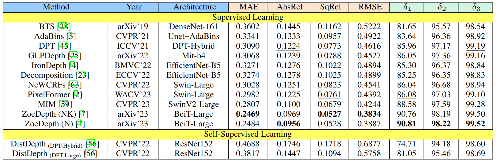

# <div align=""> InSpaceType: Reconsider Space Type in Indoor Monocular Depth Estimation </div>

This repository includes codes for reproducing benchmark reuslts for the paper.


## <div align="">Data</div>

[Sample data](https://drive.google.com/file/d/1ePsiverqYofCwuZJv98tLPWSj8bNU3ne/view?usp=sharing): This contains 167MB sample data

[InSpaceType Eval set](https://drive.google.com/file/d/1d3DiLPVEEk-hRvhaEfSK6adu5DPBdlF-/view?usp=sharing): This contains 1260 RGBD pairs for evaluation use about 11.5G

For evaluation, please donwload the eval set, extract under this root folder and rename it to 'InSpaceType'

Speficially, the data structure should be

```
InSpaceType
        |---- 0001.pfm
        |---- 0001_L.jpg
        |---- 0002.pfm
        |---- 0002_L.jpg
        |---- 0003.pfm
        |---- 0003_L.jpg
        |---- ...
```

Then go to each subfolder and see respective README instruction for evalution.


[InSpaceType all data](https://drive.google.com/drive/folders/1EjdInytpvYWBT3BmQIDsTzFyP0dngP1U?usp=sharing): This contains 40K RGBD pairs, about 500G the whole InSpaceType dataset. The whole data is split into 8 chunks. Please download all chunks in the folder and extract them.

The data is indexed by <seq_num> folders. In each folder, it contains images and depth maps.

## <div align="">Benchmark</div>

<font size="30"> Overall benchmark: </font>


<font size="30"> Sample SpaceType breakdown: </font>


<font size="30"> Sample heirarchy labeling and breakdown: </font>


Please refer to the paper and the supplementary for the full results.

## License
The dataset is CC BY-SA 4.0 licensed.
