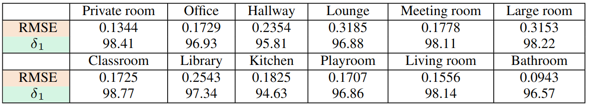

# <div align=""> InSpaceType: Reconsider Space Type in Indoor Monocular Depth Estimation </div>

This repository includes codes for reproducing benchmark reuslts for the paper.

This work is presented in CoRL 2023 OOD Workshops

[[Long version paper]](https://arxiv.org/abs/2309.13516) [[Supplementary Material]](https://drive.google.com/file/d/1KO2xJ7e9WoSdeiEkBXDAQwjZnuSKvNXm/view?usp=sharing) [[Workshop Page]](https://openreview.net/forum?id=SYz0lN3n0H) [[Project Page]](https://depthcomputation.github.io/DepthPublic/)

## <div align="">Data</div>

[Sample data](https://drive.google.com/file/d/1ePsiverqYofCwuZJv98tLPWSj8bNU3ne/view?usp=sharing): This contains 167MB sample data

[InSpaceType Eval set](https://drive.google.com/file/d/1d3DiLPVEEk-hRvhaEfSK6adu5DPBdlF-/view?usp=sharing): This contains 1260 RGBD pairs for evaluation use about 11.5G

For evaluation, please donwload the eval set, extract under this root folder and rename it to 'InSpaceType'

Speficially, the data structure should be

```
InSpaceType
        |---- 0001.pfm
        |---- 0001_L.jpg
        |---- 0002.pfm
        |---- 0002_L.jpg
        |---- 0003.pfm
        |---- 0003_L.jpg
        |---- ...
```

## <div align="">SOTA update</div>

* [Depth-Anything](https://github.com/LiheYoung/Depth-Anything) v.s. [ZoeDepth](https://github.com/isl-org/ZoeDepth) (updated Jan 29, 2024, inference by its metric depth model finetuned on NYUv2)

In short, Depth-Anything outperforms ZoeDepth and VPD in errors metrics and delta_3. Depth-Anything is also surprisingly a robust method across different space types, where errors and delta did not suffer from large variation across different space types. Compared with ZoeDepth, which has much lower performance (errors and delta_1) in large room, kitchen, and hallway, but Depth-Anything is quite steady in those evaluations

| Depth-Anything | AbsRel | SqRel | RMSE | delta_1 | delta_2 | delta_3 |
|-------------|-------------|--------------|-----------|------|-----------|---------|
| Private room | 0.0836  | 0.0297 | 0.2500 | 91.87  | 98.78 | 99.80 |
| Office | 0.0990  | 0.0454 | 0.313 | 88.12  | 97.61 | 99.45 | 
| Hallway | 0.1074  | 0.0683 | 0.4726 | 87.02  | 96.55 | 99.05 | 
| Lounge | 0.1053  | 0.0920 | 0.631 | 88.34  | 97.69 | 99.33 | 
| Meeting Room | 0.0899  | 0.0462 | 0.3591 | 90.28  | 98.52 | 99.76 | 
| Large Room | 0.1051  | 0.0974 | 0.686 | 88.61  | 97.91 | 99.27 | 
| Classroom| 0.0870  | 0.0426 | 0.3465 | 90.24  | 98.61 | 99.81 | 
| Library |0.0947  | 0.0641 | 0.5150 | 90.08  | 98.09 | 99.43 | 
| Kitchen | 0.0863  | 0.0390 | 0.2480 | 91.97  | 97.99 | 99.13 | 
| Playroom |0.0871  | 0.0416 | 0.3453 | 91.23  | 98.38 | 99.62 | 
| Living Room | 0.0921  | 0.0472 | 0.3448 | 90.26  | 97.80 | 99.47 | 
| Bathroom | 0.0860  | 0.0337 | 0.1965 | 92.71  | 99.72 | 98.76 | 
| Overall | 0.0928 | 0.0506 | 0.3806 | 90.01 | 98.09 | 99.54 |

| ZoeDepth (N) | AbsRel | SqRel | RMSE | delta_1 | delta_2 | delta_3 |
|-------------|-------------|--------------|-----------|------|-----------|---------|
| Private room | 0.0798  | 0.0253 | 0.2218 | 93.86  | 99.44 | 99.90 |
| Office | 0.0978  | 0.0447 | 0.3102 | 90.07  | 97.80 | 99.52 | 
| Hallway|  0.1193 | 0.0741 | 0.5271 | 85.84 | 96.95 | 99.10 |
| Lounge | 0.1172 | 0.1110 | 0.7033 | 86.61 | 97.02 | 99.11 | 
| Meeting Room |  0.0887 | 0.0391 | 0.3379 | 93.55 | 99.05 | 99.79  | 
| Large Room |  0.1565 | 0.1701 | 0.9157  | 77.19 | 94.95 | 99.33 |
| Classroom | 0.0719 | 0.0282 | 0.2873| 95.37 | 99.43 | 99.91 |
| Library | 0.1163 | 0.0875 | 0.6274 | 87.34 | 96.93 | 98.99  | 
| Kitchen | 0.1256 | 0.0589 | 0.2825  | 87.10 | 96.70 | 98.00 | 
| Playroom | 0.0790 | 0.0300 | 0.2508 | 94.21 | 98.09 | 99.88 |
| Living Room | 0.0862 | 0.0390 | 0.3036  | 91.72 | 98.31 | 99.58  |  
| Bathroom |  0.1065 | 0.0358 | 0.1880 | 93.64 | 97.64 | 98.17 |
| Overall | 0.0962 | 0.0533 | 0.3890 | 90.81 | 98.22 | 99.52 |

* Added [VPD](https://vpd.ivg-research.xyz/)

| VPD | AbsRel | SqRel | RMSE | delta_1 | delta_2 | delta_3 |
|-------------|-------------|--------------|-----------|------|-----------|---------|
| Private room | 0.0768  | 0.0325 | 0.2428 | 93.76  | 98.70 | 99.60 |
| Office | 0.1019  | 0.0548 | 0.3374 | 89.52  | 97.52 | 99.26 | 
| Hallway | 0.1174  | 0.0828 | 0.5233 | 86.66  | 96.40 | 98.72 | 
| Lounge | 0.1313  | 0.1286 | 0.7306 | 83.06  | 95.90 | 98.83 | 
| Meeting Room | 0.0992  | 0.0568 | 0.3742 | 91.51  | 98.262 | 99.43 | 
| Large Room | 0.1292  | 0.1460 | 0.7903 | 83.90  | 95.87 | 98.89 | 
| Classroom| 0.0744  | 0.0344 | 0.3034 | 94.73  | 98.94 | 99.72 | 
| Library |0.1258  | 0.1311 | 0.6885 | 85.22  | 95.34 | 98.62 | 
| Kitchen | 0.0958  | 0.0538 | 0.2469 | 92.56  | 96.36 | 98.64 | 
| Playroom |0.0735  | 0.0313 | 0.2574 | 95.17  | 98.38 | 99.83 | 
| Living Room | 0.0910  | 0.0510 | 0.3490 | 91.45  | 97.59 | 99.25 | 
| Bathroom | 0.0955  | 0.0472 | 0.2279 | 92.95  | 97.04 | 97.98 | 
| Overall | 0.0983 | 0.0661 | 0.1412 | 90.23 | 97.48 | 99.22 |

## <div align="">Analysis tool</div>

Go to each method subfolder (last updated: 12 recent SOTA methods, keep growing and updating with the trends) and see respective README instruction for evalution. All the execution results contain a pile of *.txt file. *-all means overall performance. H0-H2 means level of hierarchy. and H1_xx means scene space type number. See [space_type_def.yml](https://github.com/DepthComputation/InSpaceType_Benchmark/blob/main/space_type_def.yml) for space type number definition.

[InSpaceType all data](https://drive.google.com/drive/folders/1EjdInytpvYWBT3BmQIDsTzFyP0dngP1U?usp=sharing): This contains 40K RGBD pairs, about 500G the whole InSpaceType dataset. The whole data is split into 8 chunks. Please download all chunks in the folder and extract them under the root folder. Filepath reads are all written to be relative to the root path.

The data is indexed by <seq_num> folders. In each folder, it contains images and depth maps.

## <div align="">Analysis in a nutshell</div>

<font size="45"> **Analysis I-II [Benchmark on overall performance and space type breakdown]:**</font><br>
The table shows challenging InSpaceType benchmark for the overall performance, following the major monocular depth estimation protocol and metrics. We adopt the following publicly released models trained on NYUv2 for evaluation. Recent work using larger-scale backbone models obtains lower error and higher accuracy.<br>
<br>

Sample SpaceType breakdown is shown as follows. Different from conventional monocular depth estimation protocols, our work pioneers to study space type breakdown for a method. This provides a hint on how a method performs across different space types. From the following table one can observe the state-of-the-art models suffer from major performance imbalance issue. Both methods have similar easy and hard type which are potentially inherited from NYUv2. Directly deploying those SOTA models for in-the-wild application can add robustness concern.<br>
<br>

<font size="45">**Analysis III [Training datasets]:**</font><br>
In addition to NYUv2, we analyze other popular training datasets: Hypersim, SimSIN, UniSIN for indoor moncular depth estimation. One can find models trained on each training dataset also suffer from imbalance between space types, revealing their underlying bias. We also find that kitchen is a special type with lower RMSE but also very low accuracy. We assume this is because kitchen contains many cluttered small objects, such as bottles, kitchenware, and utensils in the near field. Current synthetic datasets (SimSIN, Hypersim) may not attain the same level of simulation complexity and thus training on them may not match the real-world complexity.<br>


<br>

<font size="45">**Analysis IV-V [Dataset fitting and bias mitigation]:**</font><br>
We first creat a larger InSpaceType training set and study a dataset fitting problem. This aims to show how each space type fits when training all the types together and attempts to observe concordance between types. From the table large room and lounge are large-size spaces and naturally result in slightly higher RMSE. It is worth noting that there is an apparent trend: for errors, larger rooms and longer ranges tend to have a higher estimation error; for accuracy, arbitrarily arranged small objects in the near field are challenging, a frequent scenario for kitchen.<br>

<br>

We then study three different strategies to alleviate type imbalanceL meta-learning (ML), class reweighting (CR), and class-balance sampler (CBS). One can find CBS and ML are better strategies to attain lower standard deviation across types (t-STD) and better overall performance. Though CR attains lower t-STD, its overall performance drop as well. This is because CR could harm head-class performances as observed in literature.<br>
<br>


<font size="45">**Analysis VI [Intra-group generalization]**</font><br>
We next investigate generalization to unseen types. We divide the whole InSpaceType training set into different splits, train on each division, and then evaluate on InSpaceType eval split. The whole training set is divided into three groups based on similarity between types and concerns a situation where one collects training data almost in the same functionality that matches the primary application scenarios without considering different user scenarios. The left half shows generalization to other types, and the right half shows evaluation on different depth ranges. Training on specific groups can produce good performance on its dedicated types. However, one can observe training on only some types encounters severe issues in generalization to other unseen types, which further reveal high variation between different indoor environments, and pretrained knowledge on some types may not easily transfer to other types.<br>
<br>

<font size="45">**Conclusion:**</font><br>
Unlike previous methods that focus on algorithmic developments, we are the first work to consider space types in indoor monocular depth estimation for robustness and practicability in deployment. We point out limitations in previous evaluations where performance variances across types are overlooked and present a novel dataset, InSpaceType, along with a hierarchical space type definition to facilitate our study. We give thorough studies to analyze and benchmark performance based on space types. Ten high-performing methods are examined, and we find they suffer from severe performance imbalance between space types. We analyze a total of 4 training datasets and enumerate their strength and weakness space types. 3 popular strategies, namely, class reweighting, type-balanced sampler, and meta-learning, are studied to mitigate imbalance. Further, we find generalization to unseen space types challenging due to high diversity of objects and mismatched scales across types. Overall, this work pursues a practical purpose and emphasizes the importance of this usually overlooked factor- space type in indoor environments. We call for attention to safety concerns for model deployment without considering performance variance across space types.<br>

<font size="45">**Sample heirarchy labeling and breakdown**</font><br>


Please refer to the paper and the supplementary for the full results.

## <div align="">Bibtex</div>

If you find our work useful, please consider to cite our work 

    @article{wu2023inspacetype,
          title={InSpaceType: Reconsider Space Type in Indoor Monocular Depth Estimation},
          author={Wu, Cho-Ying and Gao, Quankai and Hsu, Chin-Cheng and Wu, Te-Lin and Chen, Jing-Wen and Neumann, Ulrich},
          journal={arXiv preprint arXiv:2309.13516},
          year={2023}
        }


## License
The dataset is CC BY-SA 4.0 licensed.
